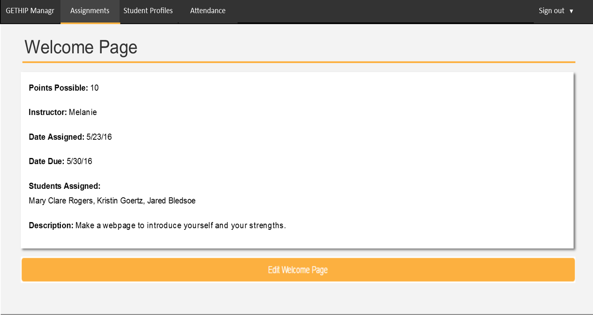

# Managr
Managr is the student management system for Gallup's Educational Taskforce High school Innovation Program (GET HIP). It combines instructor blog posts, assignments, student profiles, and attendance to make a single place for instructors and students to communicate. Managr is being created by current GET HIP summer interns split into 3 teams.

Sections in this document:
- [Teams](#teams)
- [Colors Used](#colors-used)
- [Blog Posts](#blog-posts)
- [Assignments](#assignments)
- [Student Profiles](#student-profiles)
- [Attendance](#attendance)

##Teams
[Back to top](#managr)

Team 1 will be creating the blog post portion of Managr. Team 1 will be led by Cooper Knaak and will have the following GET HIP interns:
- Eddie Yuan
- Kristin Goertz
- Jacob Gideon
- Jared Bledsoe
- Mary Clare Rogers

Team 2 will be creating the assignments portion of Managr. Team 2 will be led by Melanie Powell and will have the following GET HIP interns:
- Cate Longo
- Emily Zhang
- Jason Huang
- Matt Meacham
- Thomas Gerot

Team 3 will be creating the student profiles and attendance portions of Managr. Team 3 will be led by Max van Klinken and will have the following GET HIP interns:
- Ben Wingerter
- Dash Wedergren
- Kevin Lin
- Rohan Thakker

## Colors Used
[Back to top](#managr)

| Color Description | Hex Code | RGB |
| --- | --- | --- |
| Green in blog posts | #61c250 | 97,194,80 |
| Gold in assignments | #fcb040 | 252,176,64 |
| Blue in profiles | #0397d7 | 3,151,215 |
| Orange in attendance | #f58028 | 245,128,40 |
| Dark grey text and nav bars | #333333 | 51,51,51 |
| Light grey background | #f3f3f3 | 243,243,243 |
| Medium-dark grey top nav hover | #444444 | 68,68,68 |
| Medium-light grey even numbered rows in all tables | #eeeeee | 238,238,238 |
| Light gold hover row in assignments | #fef1de | 254,241,222 |
| Light blue hover row in profiles | #e0f5fe | 224,245,254 |

## Blog Posts
[Back to top](#managr)

The blog posts page acts as the home page of Managr. When no user is logged in, it will show Jim Collison's blog posts only. There will be no link to sign in on the home page. It will also have a left side nav bar with recent posts, comments, and archives.

Anyone will be able to see and add comments by clicking "View Comments" in the bottom left corner of a blog post.

To sign in, a user will need to add "/member" to the URL. A top nav bar will appear with a sign in link.

When a student is signed in, the top nav bar will include links to their profile and assignments, and the blog page will include posts by other instructors.

When an instructor is signed in, they will be able to create blog posts, and the top nav bar will include links to a student profiles page, assignments, and attendance.

## Assignments
[Back to top](#managr)

Subsections in Assignments:
- [Student View](#student-view-assignments)
- [Instructor View](#instructor-view-assignments)

### Student View Assignments
[Back to Assignments](#assignments)

The main page of assignments for a student will show an overview of the assignments assigned to that student.

Each assignment in the table is clickable and when clicked will show a more detailed description of that assignment.

### Instructor View Assignments
[Back to Assignments](#assignments)

The main page of assignments for an instructor will let the instructor create a new assignment and will show an overview of all the assignments in the system which are all deletable from this screen.

Each assignment in the table is clickable and when clicked will show a more detailed description of that assignment. An instructor can choose to update an assignment as well.

When an instructor chooses to edit an assignment, that instructor can change that assignment's name, points possible, date due, description, and students assigned.

## Student Profiles
[Back to top](#managr)

Subsections in Assignments:
- [Student View](#student-view-profiles)
- [Instructor View](#instructor-view-profiles)

### Student View Profiles
[Back to Student Profiles](#student-profiles)

A student can view and edit their own information, view their attendance, and view their assignment grades.

From this screen, student is able to update their "About Me" section which includes their basic information including school, year, email address, parent/guardian names, year in GET HIP, and top 5 strengths.

### Instructor View Profiles
[Back to Student Profiles](#student-profiles)

From the main page of profiles, an instructor can see a list of students and basic information about them including their names, schools, years in schoo, email addresses, years in GET HIP, attendance scores, and grades (percentages). Instructors can delete students who drop out of the program and email all the students in the system.

Each student in the table is clickable and when clicked will show a more detailed description of that student. 

The only difference between this more detailed view and the student view of their own profile is the instructors' ability to edit the student's grades.

##Attendance
[Back to top](#managr)

